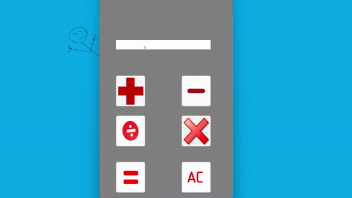

# WindowsForms
## Программы
- **Microsoft Visual Studio**
## Актуальность
Актуальность Windows Forms заключается в том, что она является простой и понятной технологией для создания настольных приложений, имеет хорошую производительность, может быть отличным выбором для разработчиков, которые хотят создать быстрое приложение для Windows.

 
<i>Используемый язык для WindowsForms</i>

  

## Особенности и работа калькулятора

 
<i>Зарядное устройство Type-C</i>

### Вывод

Знания работы с данным приложением помогают в различных сферах жизни, что является важным навыком необходимым современному инжинеру, конструктуру, архитектуру или дизайнеру.

### Контакты
* VK: <a href="https://vk.com/doobada">Артём Богданов</a>
* mail: bogdanov200412@gmail.com

